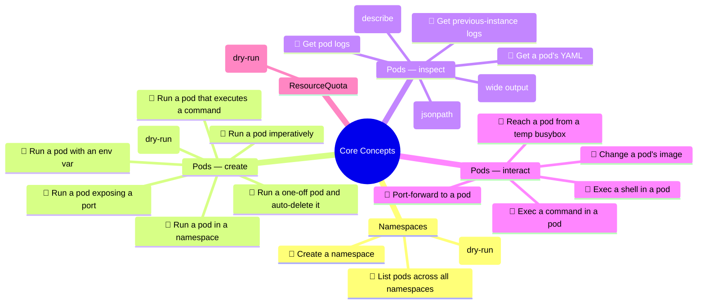

# Core Concepts (13%) — Mind Graph

Source: [dgkanatsios/CKAD-exercises › a.core_concepts.md](https://github.com/dgkanatsios/CKAD-exercises/blob/master/a.core_concepts.md)

The graph decomposes the "Core Concepts" domain into categories → topics → **leaf tasks**.
A leaf task (🍃) is an atomic exercise that can be completed with a **single command**.
Each leaf maps 1:1 to a flashcard in [`../flashcards/core_concepts.json`](../flashcards/core_concepts.json).

## Leaf-task inventory

| # | Category | Leaf task | Single command |
|---|----------|-----------|----------------|
| 1 | Namespaces | Create a namespace | `kubectl create namespace mynamespace` |
| 2 | Namespaces | Generate namespace YAML | `kubectl create namespace myns --dry-run=client -o yaml` |
| 3 | Namespaces | List pods in all namespaces | `kubectl get po -A` |
| 4 | Pods/create | Run a pod imperatively | `kubectl run nginx --image=nginx --restart=Never` |
| 5 | Pods/create | Run a pod in a namespace | `kubectl run nginx --image=nginx --restart=Never -n mynamespace` |
| 6 | Pods/create | Generate pod YAML | `kubectl run nginx --image=nginx --restart=Never --dry-run=client -o yaml` |
| 7 | Pods/create | Run a pod exposing a port | `kubectl run nginx --image=nginx --restart=Never --port=80` |
| 8 | Pods/create | Run a pod with an env var | `kubectl run nginx --image=nginx --restart=Never --env=var1=val1` |
| 9 | Pods/create | Run a pod that executes a command | `kubectl run busybox --image=busybox --restart=Never --command -- env` |
| 10 | Pods/create | Run a one-off pod and auto-delete | `kubectl run busybox --image=busybox -it --rm --restart=Never -- echo 'hello world'` |
| 11 | Pods/inspect | Get a pod's YAML | `kubectl get po nginx -o yaml` |
| 12 | Pods/inspect | Get a pod's image (jsonpath) | `kubectl get po nginx -o jsonpath='{.spec.containers[].image}'` |
| 13 | Pods/inspect | Describe a pod | `kubectl describe po nginx` |
| 14 | Pods/inspect | Get a pod's IP | `kubectl get po nginx -o wide` |
| 15 | Pods/inspect | Get pod logs | `kubectl logs nginx` |
| 16 | Pods/inspect | Get previous-instance logs | `kubectl logs nginx --previous` |
| 17 | Pods/interact | Exec a shell in a pod | `kubectl exec -it nginx -- /bin/sh` |
| 18 | Pods/interact | Exec a command in a pod | `kubectl exec -it nginx -- env` |
| 19 | Pods/interact | Change a pod's image | `kubectl set image pod/nginx nginx=nginx:1.24.0` |
| 20 | Pods/interact | Port-forward to a pod | `kubectl port-forward pod/nginx 8080:80` |
| 21 | ResourceQuota | Generate a ResourceQuota YAML | `kubectl create quota myrq --hard=cpu=1,memory=1G,pods=2 --dry-run=client -o yaml` |
